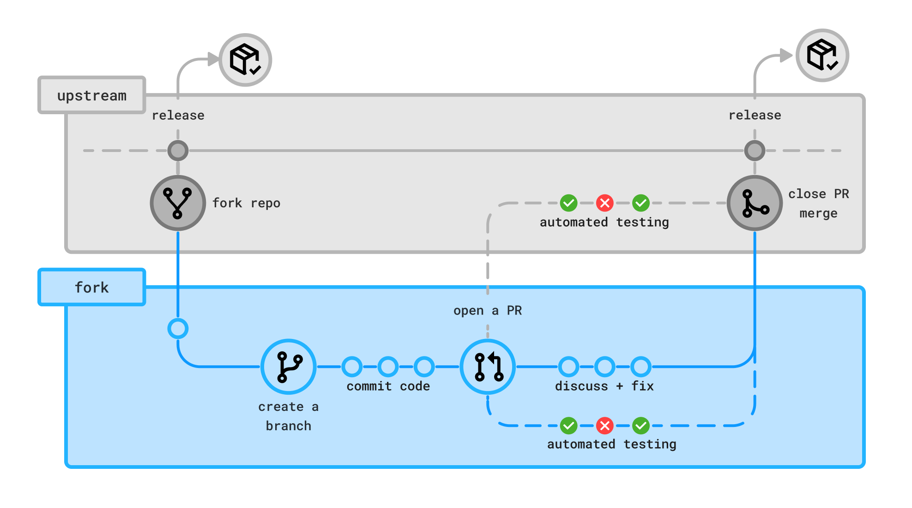

<!--
    https://docs.github.com/en/communities/setting-up-your-project-for-healthy-contributions/setting-guidelines-for-repository-contributors
-->

# Welcome to WimWitch-Reloaded contributing guide

Thank you for investing your time in contributing to this project!

Before you get started, please review the following guidelines:
Read our [Code of Conduct](./CODE_OF_CONDUCT.md) to keep our community approachable and respectable.

In this guide you will get an overview of the contribution workflow from opening an issue to get your contribution published.

## New contributors

To get an overview of the project, read the [WimWitch-Reloaded readme](../README.md).

Here are some resources to help you get started with open source contributions:

- [Finding ways to contribute to open source on GitHub](https://docs.github.com/get-started/exploring-projects-on-github/finding-ways-to-contribute-to-open-source-on-github)
- [Set up Git](https://docs.github.com/get-started/quickstart/set-up-git)
- [GitHub flow](https://docs.github.com/get-started/quickstart/github-flow)
- [Collaborating with pull requests](https://docs.github.com/github/collaborating-with-pull-requests)

## Contribution guidelines

1. Open an issue or indicate that you want any of the open issues, so others know what you are working on.
1. Fork the repository.
1. Create a branch from `main` and make your changes.
   1. Write the tests showing the desired functionality first.
   1. Write the code that makes the tests pass.
1. Open a pull request towards `upstream/main` as a draft.
   - Add any details using the PR template.
   - Link the PR to the issue you opened by adding `- Fixes #<issue_number>` so that the issue gets associated and closed with the PR.
1. **Review your own PR first!** When you are happy with it, mark it as "Ready for review".
1. Review and address comments on your pull request.
   - We do not want to close PRs directly if we disagree on a specific approach. Lets discuss it instead. We are happy to help you with your changes if there are some difficult points in the code or framework.
   - Update your branch with the latest changes from `upstream/main` before your PR is merged.
1. Once your pull request is approved, it will be merged and a new feature will be released immediately.

> [!IMPORTANT]
> In rare occation we might create a release branch and do a release from that branch, but that is more for bigger changes.
> These branches might also run with a prerelease tag, so that we can test the changes before we release it to the public.
