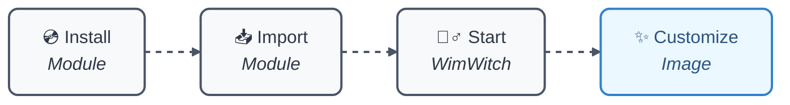

# WimWitch-Reloaded 🧙‍♂️

<div align="center">

[](https://www.powershellgallery.com/packages/WimWitch-Reloaded)
[](https://www.powershellgallery.com/packages/WimWitch-Reloaded)
[](https://www.powershellgallery.com/packages/WimWitch-Reloaded)
[](LICENSE)

</div>

> A modern PowerShell-based Windows image customization tool, born from the ashes of the original WIM-Witch project.

<!--
<div align="center">
    
</div>
-->

## 📑 Table of Contents
- [Overview](#-overview)
- [Features](#-features)
- [Requirements](#-requirements)
- [Installation](#-installation)
- [Usage](#-usage)
- [Building from Source](#️-building-from-source)
- [Testing](#-testing)
- [Contributing](#-contributing)
- [License](#-license)
- [Author](#-author)
- [Version](#-version)

## 📋 Overview

WimWitch-Reloaded is a maintained and enhanced fork of [TheNotoriousDRR's WIM-Witch](https://github.com/thenotoriousdrr/WIM-Witch) (now EOL). This project aims to continue the legacy while adding modern features and ensuring compatibility with the latest Windows versions.

## ✨ Features

<div align="center">
  <table>
    <tr>
      <td align="center">🖥️<br><b>Image Management</b></td>
      <td align="center">📦<br><b>AppX Handling</b></td>
      <td align="center">🌍<br><b>Language Support</b></td>
    </tr>
    <tr>
      <td>Windows image customization<br>Win10/11 support</td>
      <td>Package management<br>Removal & Installation</td>
      <td>Language pack integration<br>Regional settings</td>
    </tr>
  </table>
</div>

## 🔧 Requirements

- PowerShell 5.1 or higher
- Windows operating system
- Administrative privileges

## 📥 Installation

### Stable Release
```powershell
Install-Module -Name WimWitch-Reloaded
```

### Pre-Release Version
```powershell
Install-Module -Name WimWitch-Reloaded -AllowPrerelease
```

## 🚀 Usage

```powershell
Import-Module WimWitch-Reloaded
Start-WimWitch
```

## 🎯 Quick Start

<div align="center">



</div>

## 🛠️ Building from Source

To build the module:

```powershell
.\WimWitch-Reloaded.build.ps1
```

## 🧪 Testing

The project includes Pester tests and uses PSScriptAnalyzer for code quality checks. GitHub Actions workflows are set up for:
- PSScriptAnalyzer checks
- DevSkim security scanning

## 👥 Contributing

1. Fork the repository
2. Create your feature branch
3. Commit your changes
4. Push to the branch
5. Create a new Pull Request

## 📄 License

This project is licensed under the MIT License - see the [LICENSE](LICENSE) file for details.

## 👨‍💻 Author

Mickaël CHAVE

### Original Project Credits
- Based on WIM-Witch by TheNotoriousDRR ([Original Repository](https://github.com/thenotoriousdrr/WIM-Witch))
- Inspired by Alex Laurie's fork ([WimWitchFK](https://github.com/alaurie/WimWitchFK))

---

<div align="center">

**WimWitch-Reloaded** - _Keeping the magic alive_ ✨
</div>