# WimWitch-Reloaded 🧙‍♂️

<div align="center">

[](https://www.powershellgallery.com/packages/WimWitch-Reloaded)
[](https://github.com/mchave3/WimWitch-Reloaded/releases)
[](https://www.powershellgallery.com/packages/WimWitch-Reloaded)
[](LICENSE)

</div>

> A modern PowerShell-based Windows image customization tool, born from the ashes of the original WIM-Witch project.

<!--
<div align="center">
    
</div>
-->

## 📑 Table of Contents
- [Overview](#-overview)
- [Features](#-features)
- [Requirements](#-requirements)
- [Installation](#-installation)
- [Usage](#-usage)
- [Building from Source](#️-building-from-source)
- [Testing](#-testing)
- [Contributing](#-contributing)
- [License](#-license)
- [Author](#-author)

## 📋 Overview

WimWitch-Reloaded is a maintained and enhanced fork of [TheNotoriousDRR's WIM-Witch](https://github.com/thenotoriousdrr/WIM-Witch) (now EOL). This project aims to continue the legacy while adding modern features and ensuring compatibility with the latest Windows versions.

## ✨ Features

<div align="center">
  <table>
    <tr>
      <td align="center">🖥️<br><b>Image Management</b></td>
      <td align="center">📦<br><b>AppX Handling</b></td>
      <td align="center">🌍<br><b>Language Support</b></td>
    </tr>
    <tr>
      <td>Windows image customization<br>Win10/11 support</td>
      <td>Package management<br>Removal & Installation</td>
      <td>Language pack integration<br>Regional settings</td>
    </tr>
  </table>
</div>

## 🔧 Requirements

- PowerShell 5.1 or higher
- Windows operating system
- Administrative privileges

## 📥 Installation

### Stable Release
```powershell
Install-Module -Name WimWitch-Reloaded
```

### Pre-Release Version
```powershell
Install-Module -Name WimWitch-Reloaded -AllowPrerelease
```

## 🚀 Usage

```powershell
Import-Module WimWitch-Reloaded
Start-WimWitch
```

## 🎯 Quick Start

```mermaid
%%{init: { 'sequence': {'showSequenceNumbers': false}, 'theme':'default', 'flowchart': {'htmlLabels': true}, 'themeCSS': '.node rect { cursor: default !important; }' } }%%
graph LR
    A["💿 Install<br><i>Module</i>"]:::step --> B["📥 Import<br><i>Module</i>"]:::step
    B --> C["🧙‍♂️ Start<br><i>WimWitch</i>"]:::step
    C --> D["✨ Customize<br><i>Image</i>"]:::final
    
    classDef step fill:#f8f9fa,stroke:#4a5568,stroke-width:2px,color:#2d3748,rx:8,ry:8
    classDef final fill:#ebf8ff,stroke:#3182ce,stroke-width:2px,color:#2c5282,rx:8,ry:8
    linkStyle default stroke:#4a5568,stroke-width:2px,stroke-dasharray: 5 5
```

<div align="center">



</div>

## 🛠️ Building from Source

To build the module:

```powershell
.\WimWitch-Reloaded.build.ps1
```

## 🧪 Testing

The project includes Pester tests and uses PSScriptAnalyzer for code quality checks. GitHub Actions workflows are set up for:
- PSScriptAnalyzer checks
- DevSkim security scanning

## 👥 Contributing

We welcome contributions! Please follow these steps:

1. Review our [Code of Conduct](.github/CODE_OF_CONDUCT.md) and [Contributing Guidelines](.github/CONTRIBUTING.md)
2. Open an issue or claim an existing one
3. Fork the repository
4. Create a branch from `main`
5. Write tests for your changes
6. Implement your changes
7. Open a draft pull request:
   - Use the PR template
   - Link the related issue
   - Review your own changes
8. Mark as "Ready for review" when complete
9. Address any review feedback

For detailed guidance, see our [Contributing Guide](.github/CONTRIBUTING.md).

Need help getting started? Check out:
- [Setting up Git](https://docs.github.com/get-started/quickstart/set-up-git)
- [GitHub Flow](https://docs.github.com/get-started/quickstart/github-flow)
- [Working with Pull Requests](https://docs.github.com/github/collaborating-with-pull-requests)

## 📄 License

This project is licensed under the MIT License - see the [LICENSE](LICENSE) file for details.

## 👨‍💻 Author

Mickaël CHAVE

### Original Project Credits
- Based on WIM-Witch by TheNotoriousDRR ([Original Repository](https://github.com/thenotoriousdrr/WIM-Witch))
- Inspired by Alex Laurie's fork ([WimWitchFK](https://github.com/alaurie/WimWitchFK))

---

<div align="center">

**WimWitch-Reloaded** - _Keeping the magic alive_ ✨
</div>