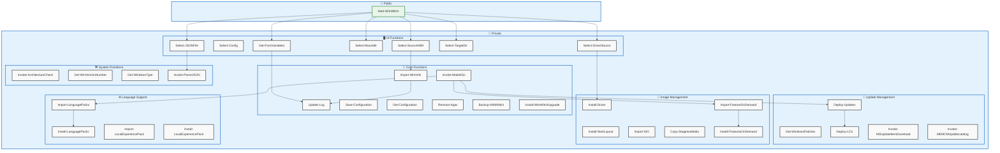

```mermaid
graph TB
    subgraph Public["📂 Public"]
        Start["Start-WimWitch"]
    end

    subgraph Private["📂 Private"]
        direction TB
        
        subgraph UI["🖥️ UI Functions"]
            GetForm["Get-FormVariables"]
            SelectConfig["Select-Config"]
            SelectSourceWIM["Select-SourceWIM"]
            SelectMountDir["Select-Mountdir"]
            SelectJSONFile["Select-JSONFile"]
            SelectTargetDir["Select-TargetDir"]
            SelectDriverSource["Select-DriverSource"]
        end

        subgraph Core["🔧 Core Functions"]
            direction LR
            UpdateLog["Update-Log"]
            SaveConfig["Save-Configuration"]
            GetConfig["Get-Configuration"]
            ImportWimInfo["Import-WimInfo"]
            RemoveAppx["Remove-Appx"]
            BackupWW["Backup-WIMWitch"]
            InstallWWUpgrade["Install-WimWitchUpgrade"]
            InvokeMakeItSo["Invoke-MakeItSo"]
        end

        subgraph Updates["🔄 Update Management"]
            direction LR
            GetWindowsPatches["Get-WindowsPatches"]
            DeployUpdates["Deploy-Updates"]
            DeployLCU["Deploy-LCU"]
            InvokeMSUpdate["Invoke-MSUpdateItemDownload"]
            InvokeMEMCMUpdate["Invoke-MEMCMUpdatecatalog"]
        end

        subgraph Image["📀 Image Management"]
            direction LR
            InstallStartLayout["Install-StartLayout"]
            ImportISO["Import-ISO"]
            CopyStageMedia["Copy-StageIsoMedia"]
            InstallDrivers["Install-Driver"]
            ImportFOD["Import-FeatureOnDemand"]
            InstallFOD["Install-FeaturesOnDemand"]
        end

        subgraph Language["🌐 Language Support"]
            ImportLP["Import-LanguagePacks"]
            InstallLP["Install-LanguagePacks"]
            ImportLEP["Import-LocalExperiencePack"]
            InstallLEP["Install-LocalExperiencePack"]
        end

        subgraph System["🛠️ System Functions"]
            CheckArch["Invoke-ArchitectureCheck"]
            GetWinVer["Get-WinVersionNumber"]
            GetWindowsType["Get-WindowsType"]
            InvokeParseJSON["Invoke-ParseJSON"]
        end
    end

    Start --> GetForm
    GetForm --> UpdateLog
    Start --> SelectSourceWIM
    SelectSourceWIM --> ImportWimInfo
    ImportWimInfo --> UpdateLog
    Start --> SelectMountDir
    Start --> SelectJSONFile
    SelectJSONFile --> InvokeParseJSON
    Start --> SelectTargetDir
    Start --> SelectDriverSource
    SelectDriverSource --> InstallDrivers

    InvokeMakeItSo --> DeployUpdates
    DeployUpdates --> DeployLCU
    InvokeMakeItSo --> ImportFOD
    ImportFOD --> InstallFOD
    InvokeMakeItSo --> ImportLP
    ImportLP --> InstallLP
    
    classDef default fill:#f9f9f9,stroke:#333,stroke-width:2px;
    classDef folder fill:#e3f2fd,stroke:#1565c0,stroke-width:2px;
    classDef public fill:#e8f5e9,stroke:#2e7d32,stroke-width:2px;
    
    class Public,Private folder;
    class Start public;
    class UI,Core,Updates,Image,Language,System folder;
```