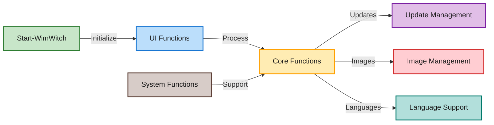

# WimWitch Functions Documentation

This directory contains the PowerShell functions that power WimWitch. The functions are organized into two main directories:

## Directory Structure

- 📂 `public/` - Contains the main entry point function
  - `Start-WimWitch` - The primary function that initiates the WimWitch workflow

- 📂 `private/` - Contains all internal functions organized by their purpose:

### 🖥️ UI Functions
Functions that handle user interface interactions and form management:
- `Get-FormVariable` - Manages form variables and controls
- `Select-Config` - Handles configuration selection
- `Select-SourceWIM` - Manages WIM source selection
- `Select-Mountdir` - Handles mount directory selection
- `Select-JSONFile` - Manages JSON file selection
- `Select-TargetDir` - Handles target directory selection
- `Select-DriverSource` - Manages driver source selection

### 🔧 Core Functions
Essential functions for WimWitch operations:
- `Update-Log` - Handles logging operations
- `Save-Configuration` - Saves current configuration
- `Get-Configuration` - Retrieves configuration settings
- `Import-WimInfo` - Imports Windows image information
- `Remove-Appx` - Manages AppX package removal
- `Backup-WIMWitch` - Handles backup operations
- `Install-WimWitchUpgrade` - Manages WimWitch upgrades
- `Invoke-MakeItSo` - Orchestrates the main build process

### 🔄 Update Management
Functions for handling Windows updates:
- `Get-WindowsPatch` - Retrieves available Windows patches
- `Deploy-Update` - Handles update deployment
- `Deploy-LCU` - Manages Latest Cumulative Update deployment
- `Invoke-MSUpdateItemDownload` - Handles Microsoft Update downloads
- `Invoke-MEMCMUpdatecatalog` - Manages MEMCM update catalog operations

### 📀 Image Management
Functions for Windows image manipulation:
- `Install-StartLayout` - Manages Start Menu layout
- `Import-ISO` - Handles ISO file importing
- `Copy-StageIsoMedia` - Manages ISO staging
- `Install-Driver` - Handles driver installation
- `Import-FeatureOnDemand` - Imports Features on Demand
- `Install-FeaturesOnDemand` - Installs Features on Demand

### 🌐 Language Support
Functions for language management:
- `Import-LanguagePack` - Imports language packs
- `Install-LanguagePack` - Installs language packs
- `Import-LocalExperiencePack` - Imports Local Experience Packs
- `Install-LocalExperiencePack` - Installs Local Experience Packs

### 🛠️ System Functions
Core system and utility functions:
- `Invoke-ArchitectureCheck` - Verifies system architecture
- `Get-WinVersionNumber` - Retrieves Windows version
- `Get-WindowsType` - Determines Windows edition type
- `Invoke-ParseJSON` - Handles JSON parsing operations

## Function Flow

The function flow is visualized in the Mermaid diagram below, showing the relationships and dependencies between different components:

