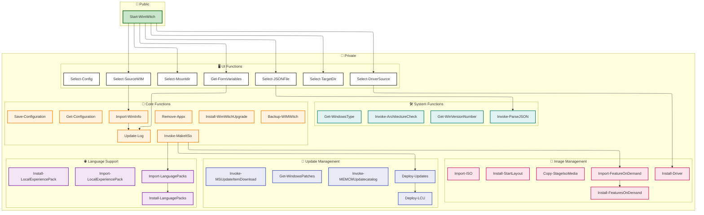

```mermaid
---
config:
  theme: default
  layout: elk
---
flowchart TB
 subgraph Public["📂 Public"]
        Start["Start-WimWitch"]
  end
 subgraph UI["🖥️ UI Functions"]
        GetForm["Get-FormVariables"]
        SelectConfig["Select-Config"]
        SelectSourceWIM["Select-SourceWIM"]
        SelectMountDir["Select-Mountdir"]
        SelectJSONFile["Select-JSONFile"]
        SelectTargetDir["Select-TargetDir"]
        SelectDriverSource["Select-DriverSource"]
  end
 subgraph Core["🔧 Core Functions"]
    direction LR
        UpdateLog["Update-Log"]
        SaveConfig["Save-Configuration"]
        GetConfig["Get-Configuration"]
        ImportWimInfo["Import-WimInfo"]
        RemoveAppx["Remove-Appx"]
        BackupWW["Backup-WIMWitch"]
        InstallWWUpgrade["Install-WimWitchUpgrade"]
        InvokeMakeItSo["Invoke-MakeItSo"]
  end
 subgraph Updates["🔄 Update Management"]
    direction LR
        GetWindowsPatches["Get-WindowsPatches"]
        DeployUpdates["Deploy-Updates"]
        DeployLCU["Deploy-LCU"]
        InvokeMSUpdate["Invoke-MSUpdateItemDownload"]
        InvokeMEMCMUpdate["Invoke-MEMCMUpdatecatalog"]
  end
 subgraph Image["📀 Image Management"]
    direction LR
        InstallStartLayout["Install-StartLayout"]
        ImportISO["Import-ISO"]
        CopyStageMedia["Copy-StageIsoMedia"]
        InstallDrivers["Install-Driver"]
        ImportFOD["Import-FeatureOnDemand"]
        InstallFOD["Install-FeaturesOnDemand"]
  end
 subgraph Language["🌐 Language Support"]
        ImportLP["Import-LanguagePacks"]
        InstallLP["Install-LanguagePacks"]
        ImportLEP["Import-LocalExperiencePack"]
        InstallLEP["Install-LocalExperiencePack"]
  end
 subgraph System["🛠️ System Functions"]
        CheckArch["Invoke-ArchitectureCheck"]
        GetWinVer["Get-WinVersionNumber"]
        GetWindowsType["Get-WindowsType"]
        InvokeParseJSON["Invoke-ParseJSON"]
  end
 subgraph Private["📂 Private"]
    direction TB
        UI
        Core
        Updates
        Image
        Language
        System
  end
    Start --> GetForm & SelectSourceWIM & SelectMountDir & SelectJSONFile & SelectTargetDir & SelectDriverSource
    GetForm --> UpdateLog
    SelectSourceWIM --> ImportWimInfo
    ImportWimInfo --> UpdateLog
    SelectJSONFile --> InvokeParseJSON
    SelectDriverSource --> InstallDrivers
    InvokeMakeItSo --> DeployUpdates & ImportFOD & ImportLP
    DeployUpdates --> DeployLCU
    ImportFOD --> InstallFOD
    ImportLP --> InstallLP
     Start:::public
     UpdateLog:::core
     SaveConfig:::core
     GetConfig:::core
     ImportWimInfo:::core
     RemoveAppx:::core
     BackupWW:::core
     InstallWWUpgrade:::core
     InvokeMakeItSo:::core
     GetWindowsPatches:::updates
     DeployUpdates:::updates
     DeployLCU:::updates
     InvokeMSUpdate:::updates
     InvokeMEMCMUpdate:::updates
     InstallStartLayout:::image
     ImportISO:::image
     CopyStageMedia:::image
     InstallDrivers:::image
     ImportFOD:::image
     InstallFOD:::image
     ImportLP:::language
     InstallLP:::language
     ImportLEP:::language
     InstallLEP:::language
     CheckArch:::system
     GetWinVer:::system
     GetWindowsType:::system
     InvokeParseJSON:::system
    classDef default fill:#ffffff,stroke:#333,stroke-width:2px
    classDef folder fill:#e1f5fe,stroke:#0288d1,stroke-width:2px
    classDef public fill:#c8e6c9,stroke:#2e7d32,stroke-width:3px
    classDef function fill:#ffffff,stroke:#555,stroke-width:2px
    classDef core fill:#fff3e0,stroke:#f57c00,stroke-width:2px
    classDef updates fill:#e8eaf6,stroke:#3f51b5,stroke-width:2px
    classDef image fill:#fce4ec,stroke:#c2185b,stroke-width:2px
    classDef language fill:#f3e5f5,stroke:#7b1fa2,stroke-width:2px
    classDef system fill:#e0f2f1,stroke:#00796b,stroke-width:2px

```