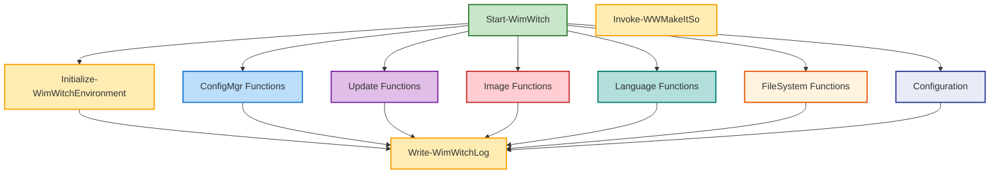

# 🧙‍♂️ WimWitch Functions Documentation

> Comprehensive documentation of PowerShell functions powering WimWitch, organized by modules.

---

## 📋 Table of Contents

1. [Directory Structure](#-directory-structure)
2. [Function Flow and Dependencies](#-function-flow-and-dependencies)
   - [Public Functions](#-public-functions)
   - [Core Module](#️-core-module)
   - [ConfigMgr Module](#️-configmgr-module)
   - [Windows Update Module](#-windows-update-module)
   - [Image Management Module](#️-image-management-module)
   - [Language Management Module](#-language-management-module)
   - [FileSystem Module](#-filesystem-module)
   - [Configuration Module](#️-configuration-module)
   - [OneDrive Module](#️-onedrive-module)
3. [Dependency Flow Diagram](#-dependency-flow-diagram)
4. [Usage Guidelines](#-usage-guidelines)

---

## 📁 Directory Structure

```
src/functions/
├── 📂 public/               # User-exposed functions
└── 📂 private/              # Internal module functions
    ├── Core/               # Core and essential functions
    ├── ConfigMgr/          # Configuration Manager integration
    ├── WindowsUpdate/      # Windows Update management
    ├── FileSystem/         # File system operations
    ├── ImageManagement/    # Windows image management
    ├── LanguageManagement/ # Language pack handling
    ├── OneDrive/           # OneDrive integration
    ├── Configuration/      # Configuration management
    └── Utilities/          # Utility functions
```

---

## 🔄 Function Flow and Dependencies

### 🚀 Public Functions

<details open>
<summary><b>Entry Point Functions</b></summary>

#### [`Start-WimWitch`](public/Start-WimWitch.ps1)
> Main application entry point that orchestrates the entire process.

**Direct Dependencies:**
- Core:
  - [`Initialize-WimWitchEnvironment`](private/Core/Initialize-WimWitchEnvironment.ps1)
  - [`Write-WimWitchLog`](private/Core/Write-WimWitchLog.ps1)
  - [`Test-WWAdministrator`](private/Core/Test-WWAdministrator.ps1)
  - [`Invoke-WWArchitectureCheck`](private/Core/Invoke-WWArchitectureCheck.ps1)
- ConfigMgr:
  - [`Enable-WWConfigManagerOption`](private/ConfigMgr/Enable-WWConfigManagerOption.ps1)
  - [`Find-WWConfigManager`](private/ConfigMgr/Find-WWConfigManager.ps1)
  - [`Import-WWConfigManagerModule`](private/ConfigMgr/Import-WWConfigManagerModule.ps1)
- FileSystem:
  - [`Select-WWMountDirectory`](private/FileSystem/Select-WWMountDirectory.ps1)
  - [`Select-WWSourceWIM`](private/UI/Select-WWSourceWIM.ps1)
  - [`Select-WWJSONFile`](private/FileSystem/Select-WWJSONFile.ps1)
  - [`Select-WWTargetDirectory`](private/FileSystem/Select-WWTargetDirectory.ps1)
  - [`Select-WWDriverSource`](private/FileSystem/Select-WWDriverSource.ps1)
- Deployment:
  - [`Install-WWOSDeployment`](private/ConfigMgr/Install-WWOSDeployment.ps1)
  - [`Install-WWOSDServiceUpdateStack`](private/ConfigMgr/Install-WWOSDServiceUpdateStack.ps1)

</details>

---

### 🛠️ Core Module

<details open>
<summary><b>Core Functions</b></summary>

#### [`Initialize-WimWitchEnvironment`](private/Core/Initialize-WimWitchEnvironment.ps1)
> Sets up the initial environment for WimWitch operations.

**Purpose:**
- Creates necessary folder structure
- Initializes logging system
- Validates environment requirements

**Dependencies:**
- [`Write-WimWitchLog`](private/Core/Write-WimWitchLog.ps1)
- [`Test-WWWorkingDirectory`](private/Core/Test-WWWorkingDirectory.ps1)

<hr style="border-top: 1px dashed #ccc">

#### [`Write-WimWitchLog`](private/Core/Write-WimWitchLog.ps1)
> Central logging system for all WimWitch operations.

**Purpose:**
- Provides consistent logging across all functions
- Supports multiple log levels
- Includes timestamps and context

**Dependencies:** None

<hr style="border-top: 1px dashed #ccc">

#### [`Invoke-WWMakeItSo`](private/Core/Invoke-WWMakeItSo.ps1)
> Main orchestrator for the WIM build process.

**Purpose:**
- Coordinates the entire build workflow
- Manages dependencies between operations
- Handles error conditions

**Dependencies:**
- Logging:
  - [`Write-WimWitchLog`](private/Core/Write-WimWitchLog.ps1)
- Updates:
  - [`Test-WWSuperseded`](private/WindowsUpdate/Test-WWSuperseded.ps1)
  - [`Get-WWWindowsPatch`](private/WindowsUpdate/Get-WWWindowsPatch.ps1)
- Image Management:
  - [`Install-WWDriver`](private/Core/Install-WWDriver.ps1)
  - [`Import-WWFeatureOnDemand`](private/ImageManagement/Import-WWFeatureOnDemand.ps1)
  - [`Install-WWFeaturesOnDemand`](private/ImageManagement/Install-WWFeaturesOnDemand.ps1)

<hr style="border-top: 1px dashed #ccc">

#### [`Backup-WIMWitch`](private/Core/Backup-WIMWitch.ps1)
> Manages backup operations for WimWitch files.

**Purpose:**
- Creates backup copies of critical files
- Maintains backup history
- Ensures data safety

**Dependencies:**
- [`Write-WimWitchLog`](private/Core/Write-WimWitchLog.ps1)

<hr style="border-top: 1px dashed #ccc">

#### [`Clear-WWMISCheckBox`](private/Core/Clear-WWMISCheckBox.ps1)
> Manages MIS checkbox selections in the UI.

**Purpose:**
- Resets UI state
- Cleans up user selections
- Maintains UI consistency

**Dependencies:**
- [`Write-WimWitchLog`](private/Core/Write-WimWitchLog.ps1)

</details>

<details>
<summary><b>Additional Core Functions</b></summary>

#### [`Clear-WWOSIndex`](private/Core/Clear-WWOSIndex.ps1)
> Manages OS index selection state.

**Purpose:**
- Resets OS index selections
- Maintains clean state
- Prepares for new operations

**Dependencies:**
- [`Write-WimWitchLog`](private/Core/Write-WimWitchLog.ps1)

<hr style="border-top: 1px dashed #ccc">

#### [`Compare-WWOSDBuilderVersion`](private/Core/Compare-WWOSDBuilderVersion.ps1)
> Handles version comparison for OSDBuilder.

**Purpose:**
- Validates version compatibility
- Ensures system requirements
- Manages updates

**Dependencies:**
- [`Write-WimWitchLog`](private/Core/Write-WimWitchLog.ps1)

<hr style="border-top: 1px dashed #ccc">

#### [`Compare-WWOSDSUSVersion`](private/Core/Compare-WWOSDSUSVersion.ps1)
> Manages OSDSUS version comparisons.

**Purpose:**
- Checks update compatibility
- Validates versions
- Ensures consistency

**Dependencies:**
- [`Write-WimWitchLog`](private/Core/Write-WimWitchLog.ps1)

<hr style="border-top: 1px dashed #ccc">

#### [`Import-WWVersionCallback`](private/Core/Import-WWVersionCallback.ps1)
> Handles version callback functionality.

**Purpose:**
- Manages version updates
- Processes callbacks
- Maintains version state

**Dependencies:**
- [`Write-WimWitchLog`](private/Core/Write-WimWitchLog.ps1)

<hr style="border-top: 1px dashed #ccc">

#### [`Install-WimWitchUpgrade`](private/Core/Install-WimWitchUpgrade.ps1)
> Manages WimWitch upgrades.

**Purpose:**
- Handles version upgrades
- Manages upgrade process
- Ensures upgrade integrity

**Dependencies:**
- [`Write-WimWitchLog`](private/Core/Write-WimWitchLog.ps1)

<hr style="border-top: 1px dashed #ccc">

#### [`Invoke-WW19041Select`](private/Core/Invoke-WW19041Select.ps1)
> Handles Windows 10 version 2004 selection.

**Purpose:**
- Manages version selection
- Handles compatibility
- Ensures version integrity

**Dependencies:**
- [`Write-WimWitchLog`](private/Core/Write-WimWitchLog.ps1)

<hr style="border-top: 1px dashed #ccc">

#### [`Invoke-WW2XXXPreReq`](private/Core/Invoke-WW2XXXPreReq.ps1)
> Manages Windows 11 prerequisites.

**Purpose:**
- Checks system requirements
- Validates compatibility
- Ensures prerequisite compliance

**Dependencies:**
- [`Write-WimWitchLog`](private/Core/Write-WimWitchLog.ps1)

<hr style="border-top: 1px dashed #ccc">

#### [`Invoke-WWBootWIMUpdate`](private/Core/Invoke-WWBootWIMUpdate.ps1)
> Updates boot WIM files.

**Purpose:**
- Manages boot image updates
- Handles WIM modifications
- Ensures boot image integrity

**Dependencies:**
- [`Write-WimWitchLog`](private/Core/Write-WimWitchLog.ps1)

<hr style="border-top: 1px dashed #ccc">

#### [`Invoke-WWCheckboxCleanup`](private/Core/Invoke-WWCheckboxCleanup.ps1)
> Manages checkbox states.

**Purpose:**
- Cleans up UI states
- Manages checkbox selections
- Ensures UI consistency

**Dependencies:**
- [`Write-WimWitchLog`](private/Core/Write-WimWitchLog.ps1)

<hr style="border-top: 1px dashed #ccc">

#### [`Invoke-WWConfigFile`](private/Core/Invoke-WWConfigFile.ps1)
> Manages configuration files.

**Purpose:**
- Handles config file operations
- Manages file content
- Ensures config integrity

**Dependencies:**
- [`Write-WimWitchLog`](private/Core/Write-WimWitchLog.ps1)

<hr style="border-top: 1px dashed #ccc">

#### [`Invoke-WWMISUpdate`](private/Core/Invoke-WWMISUpdate.ps1)
> Updates MIS components.

**Purpose:**
- Manages MIS updates
- Handles update process
- Ensures update integrity

**Dependencies:**
- [`Write-WimWitchLog`](private/Core/Write-WimWitchLog.ps1)

<hr style="border-top: 1px dashed #ccc">

#### [`Invoke-WWOSDCheck`](private/Core/Invoke-WWOSDCheck.ps1)
> Validates OSD requirements.

**Purpose:**
- Checks OSD prerequisites
- Validates system state
- Ensures deployment readiness

**Dependencies:**
- [`Write-WimWitchLog`](private/Core/Write-WimWitchLog.ps1)

<hr style="border-top: 1px dashed #ccc">

#### [`Invoke-WWRemoveISOMount`](private/Core/Invoke-WWRemoveISOMount.ps1)
> Manages ISO mount points.

**Purpose:**
- Handles ISO unmounting
- Cleans up mount points
- Ensures system cleanup

**Dependencies:**
- [`Write-WimWitchLog`](private/Core/Write-WimWitchLog.ps1)

<hr style="border-top: 1px dashed #ccc">

#### [`Invoke-WWScript`](private/Core/Invoke-WWScript.ps1)
> Executes WimWitch scripts.

**Purpose:**
- Manages script execution
- Handles script context
- Ensures script integrity

**Dependencies:**
- [`Write-WimWitchLog`](private/Core/Write-WimWitchLog.ps1)

<hr style="border-top: 1px dashed #ccc">

#### [`Rename-WWName`](private/Core/Rename-WWName.ps1)
> Manages naming operations.

**Purpose:**
- Handles name changes
- Validates naming rules
- Ensures naming consistency

**Dependencies:**
- [`Write-WimWitchLog`](private/Core/Write-WimWitchLog.ps1)

<hr style="border-top: 1px dashed #ccc">

#### [`Suspend-WWMakeItSo`](private/Core/Suspend-WWMakeItSo.ps1)
> Manages build process suspension.

**Purpose:**
- Handles process pausing
- Manages state preservation
- Ensures process integrity

**Dependencies:**
- [`Write-WimWitchLog`](private/Core/Write-WimWitchLog.ps1)

<hr style="border-top: 1px dashed #ccc">

#### [`Test-WWValidName`](private/Core/Test-WWValidName.ps1)
> Validates naming conventions.

**Purpose:**
- Checks name validity
- Enforces naming rules
- Ensures naming standards

**Dependencies:**
- [`Write-WimWitchLog`](private/Core/Write-WimWitchLog.ps1)

</details>

---

### 🖥️ ConfigMgr Module

<details open>
<summary><b>ConfigMgr Integration Functions</b></summary>

#### [`Build-WWConfigManagerImagePackage`](private/ConfigMgr/Build-WWConfigManagerImagePackage.ps1)
> Creates ConfigMgr image packages.

**Purpose:**
- Prepares image packages for deployment
- Manages package dependencies
- Ensures package consistency

**Dependencies:**
- [`Write-WimWitchLog`](private/Core/Write-WimWitchLog.ps1)
- [`Get-WWConfigManagerConnection`](private/ConfigMgr/Get-WWConfigManagerConnection.ps1)

<hr style="border-top: 1px dashed #ccc">

#### [`Enable-WWConfigManagerOption`](private/ConfigMgr/Enable-WWConfigManagerOption.ps1)
> Enables ConfigMgr integration options.

**Purpose:**
- Activates ConfigMgr features
- Manages option dependencies
- Ensures option consistency

**Dependencies:**
- [`Write-WimWitchLog`](private/Core/Write-WimWitchLog.ps1)
- [`Find-WWConfigManager`](private/ConfigMgr/Find-WWConfigManager.ps1)

<hr style="border-top: 1px dashed #ccc">

#### [`Find-WWConfigManager`](private/ConfigMgr/Find-WWConfigManager.ps1)
> Locates ConfigMgr installation.

**Purpose:**
- Detects ConfigMgr presence
- Manages installation detection
- Ensures installation consistency

**Dependencies:**
- [`Write-WimWitchLog`](private/Core/Write-WimWitchLog.ps1)

<hr style="border-top: 1px dashed #ccc">

#### [`Get-WWOSDSUSCurrentVersion`](private/ConfigMgr/Get-WWOSDSUSCurrentVersion.ps1)
> Retrieves the current version of OSDSUS.

**Purpose:**
- Gets OSDSUS version information
- Validates version compatibility
- Ensures update consistency

**Dependencies:**
- [`Write-WimWitchLog`](private/Core/Write-WimWitchLog.ps1)

<hr style="border-top: 1px dashed #ccc">

#### [`Get-WWOSDSUSInstallation`](private/ConfigMgr/Get-WWOSDSUSInstallation.ps1)
> Manages OSDSUS installation status.

**Purpose:**
- Checks installation state
- Validates installation integrity
- Ensures system compatibility

**Dependencies:**
- [`Write-WimWitchLog`](private/Core/Write-WimWitchLog.ps1)

<hr style="border-top: 1px dashed #ccc">

#### [`Get-WWOSDeploymentCurrentVersion`](private/ConfigMgr/Get-WWOSDeploymentCurrentVersion.ps1)
> Gets current OS deployment version.

**Purpose:**
- Retrieves version information
- Validates deployment version
- Ensures version compatibility

**Dependencies:**
- [`Write-WimWitchLog`](private/Core/Write-WimWitchLog.ps1)

<hr style="border-top: 1px dashed #ccc">

#### [`Get-WWOSDeploymentInstallation`](private/ConfigMgr/Get-WWOSDeploymentInstallation.ps1)
> Manages OS deployment installation.

**Purpose:**
- Checks deployment status
- Validates installation state
- Ensures deployment integrity

**Dependencies:**
- [`Write-WimWitchLog`](private/Core/Write-WimWitchLog.ps1)

<hr style="border-top: 1px dashed #ccc">

#### [`Install-WWConfigManagerConsoleExtension`](private/ConfigMgr/Install-WWConfigManagerConsoleExtension.ps1)
> Installs ConfigMgr console extensions.

**Purpose:**
- Manages console extensions
- Handles extension installation
- Ensures extension compatibility

**Dependencies:**
- [`Write-WimWitchLog`](private/Core/Write-WimWitchLog.ps1)

<hr style="border-top: 1px dashed #ccc">

#### [`Invoke-WWConfigManagerUpdateCatalog`](private/ConfigMgr/Invoke-WWConfigManagerUpdateCatalog.ps1)
> Updates ConfigMgr catalog.

**Purpose:**
- Refreshes update catalog
- Manages catalog synchronization
- Ensures catalog consistency

**Dependencies:**
- [`Write-WimWitchLog`](private/Core/Write-WimWitchLog.ps1)

<hr style="border-top: 1px dashed #ccc">

#### [`Invoke-WWConfigManagerUpdateSupersedence`](private/ConfigMgr/Invoke-WWConfigManagerUpdateSupersedence.ps1)
> Manages update supersedence.

**Purpose:**
- Handles update relationships
- Manages superseded updates
- Ensures update consistency

**Dependencies:**
- [`Write-WimWitchLog`](private/Core/Write-WimWitchLog.ps1)

<hr style="border-top: 1px dashed #ccc">

#### [`Update-WWConfigManagerImage`](private/ConfigMgr/Update-WWConfigManagerImage.ps1)
> Updates ConfigMgr images.

**Purpose:**
- Manages image updates
- Handles image versioning
- Ensures image consistency

**Dependencies:**
- [`Write-WimWitchLog`](private/Core/Write-WimWitchLog.ps1)

<hr style="border-top: 1px dashed #ccc">

#### [`Update-WWConfigManagerImageProperty`](private/ConfigMgr/Update-WWConfigManagerImageProperty.ps1)
> Updates image properties.

**Purpose:**
- Manages image metadata
- Updates image properties
- Ensures property consistency

**Dependencies:**
- [`Write-WimWitchLog`](private/Core/Write-WimWitchLog.ps1)

</details>

---

### 🔄 Windows Update Module

<details open>
<summary><b>Update Management Functions</b></summary>

#### [`Get-WWWindowsPatch`](private/WindowsUpdate/Get-WWWindowsPatch.ps1)
> Retrieves Windows updates.

**Purpose:**
- Fetches available updates
- Manages update dependencies
- Ensures update consistency

**Dependencies:**
- [`Write-WimWitchLog`](private/Core/Write-WimWitchLog.ps1)
- [`Get-WWMicrosoftUpdateItem`](private/WindowsUpdate/Get-WWMicrosoftUpdateItem.ps1)

<hr style="border-top: 1px dashed #ccc">

#### [`Test-WWSuperseded`](private/WindowsUpdate/Test-WWSuperseded.ps1)
> Checks for superseded updates.

**Purpose:**
- Validates update supersession
- Manages supersession detection
- Ensures supersession consistency

**Dependencies:**
- [`Write-WimWitchLog`](private/Core/Write-WimWitchLog.ps1)

</details>

---

### 🖼️ Image Management Module

<details open>
<summary><b>Image Management Functions</b></summary>

#### [`Import-WWFeatureOnDemand`](private/ImageManagement/Import-WWFeatureOnDemand.ps1)
> Imports Windows Features on Demand.

**Purpose:**
- Fetches feature packages
- Manages feature dependencies
- Ensures feature consistency

**Dependencies:**
- [`Write-WimWitchLog`](private/Core/Write-WimWitchLog.ps1)

<hr style="border-top: 1px dashed #ccc">

#### [`Install-WWFeaturesOnDemand`](private/ImageManagement/Install-WWFeaturesOnDemand.ps1)
> Installs Windows Features.

**Purpose:**
- Installs feature packages
- Manages feature installation
- Ensures feature consistency

**Dependencies:**
- [`Write-WimWitchLog`](private/Core/Write-WimWitchLog.ps1)
- [`Import-WWFeatureOnDemand`](private/ImageManagement/Import-WWFeatureOnDemand.ps1)

</details>

---

### 🌐 Language Management Module

<details open>
<summary><b>Language Pack Functions</b></summary>

#### [`Import-WWLanguagePack`](private/LanguageManagement/Import-WWLanguagePack.ps1)
> Imports language packs.

**Purpose:**
- Fetches language packages
- Manages language dependencies
- Ensures language consistency

**Dependencies:**
- [`Write-WimWitchLog`](private/Core/Write-WimWitchLog.ps1)

<hr style="border-top: 1px dashed #ccc">

#### [`Install-WWLanguagePack`](private/LanguageManagement/Install-WWLanguagePack.ps1)
> Installs language packs.

**Purpose:**
- Installs language packages
- Manages language installation
- Ensures language consistency

**Dependencies:**
- [`Write-WimWitchLog`](private/Core/Write-WimWitchLog.ps1)
- [`Import-WWLanguagePack`](private/LanguageManagement/Import-WWLanguagePack.ps1)

</details>

---

### 📁 FileSystem Module

<details open>
<summary><b>File System Functions</b></summary>

#### [`Select-WWDistributionPoint`](private/FileSystem/Select-WWDistributionPoint.ps1)
> Selects distribution points.

**Purpose:**
- Detects distribution points
- Manages point selection
- Ensures point consistency

**Dependencies:**
- [`Write-WimWitchLog`](private/Core/Write-WimWitchLog.ps1)

<hr style="border-top: 1px dashed #ccc">

#### [`Select-WWDriverSource`](private/FileSystem/Select-WWDriverSource.ps1)
> Selects driver sources.

**Purpose:**
- Detects driver sources
- Manages source selection
- Ensures source consistency

**Dependencies:**
- [`Write-WimWitchLog`](private/Core/Write-WimWitchLog.ps1)

</details>

---

### ⚙️ Configuration Module

<details open>
<summary><b>Configuration Management Functions</b></summary>

#### [`Get-WWConfiguration`](private/Configuration/Get-WWConfiguration.ps1)
> Retrieves configuration settings.

**Purpose:**
- Fetches configuration data
- Manages configuration dependencies
- Ensures configuration consistency

**Dependencies:**
- [`Write-WimWitchLog`](private/Core/Write-WimWitchLog.ps1)

<hr style="border-top: 1px dashed #ccc">

#### [`Save-WWSetting`](private/Configuration/Save-WWSetting.ps1)
> Saves configuration settings.

**Purpose:**
- Saves configuration data
- Manages setting dependencies
- Ensures setting consistency

**Dependencies:**
- [`Write-WimWitchLog`](private/Core/Write-WimWitchLog.ps1)

<hr style="border-top: 1px dashed #ccc">

#### [`Install-WWDefaultApplicationAssociation`](private/Configuration/Install-WWDefaultApplicationAssociation.ps1)
> Manages default app associations.

**Purpose:**
- Sets default applications
- Manages file associations
- Ensures association consistency

**Dependencies:**
- [`Write-WimWitchLog`](private/Core/Write-WimWitchLog.ps1)

<hr style="border-top: 1px dashed #ccc">

#### [`Install-WWStartLayout`](private/Configuration/Install-WWStartLayout.ps1)
> Manages Start menu layout.

**Purpose:**
- Configures Start menu
- Handles layout customization
- Ensures layout consistency

**Dependencies:**
- [`Write-WimWitchLog`](private/Core/Write-WimWitchLog.ps1)

<hr style="border-top: 1px dashed #ccc">

#### [`Select-WWDefaultApplicationAssociation`](private/Configuration/Select-WWDefaultApplicationAssociation.ps1)
> Selects default app associations.

**Purpose:**
- Manages app selection
- Handles association choices
- Ensures selection consistency

**Dependencies:**
- [`Write-WimWitchLog`](private/Core/Write-WimWitchLog.ps1)

<hr style="border-top: 1px dashed #ccc">

#### [`Select-WWStartMenu`](private/Configuration/Select-WWStartMenu.ps1)
> Manages Start menu selection.

**Purpose:**
- Handles menu customization
- Manages layout selection
- Ensures menu consistency

**Dependencies:**
- [`Write-WimWitchLog`](private/Core/Write-WimWitchLog.ps1)

</details>

---

### ☁️ OneDrive Module

<details open>
<summary><b>OneDrive Integration Functions</b></summary>

#### [`Get-WWOneDrive`](private/OneDrive/Get-WWOneDrive.ps1)
> Manages OneDrive integration.

**Purpose:**
- Detects OneDrive presence
- Manages integration dependencies
- Ensures integration consistency

**Dependencies:**
- [`Write-WimWitchLog`](private/Core/Write-WimWitchLog.ps1)

</details>

---

## 📊 Dependency Flow Diagram



---

## 📝 Usage Guidelines

### 🏷️ Naming Conventions
| Type | Convention | Example | Description |
|------|------------|---------|-------------|
| Public Functions | `Verb-WW*` | `Start-WimWitch` | Main user-facing commands |
| Private Functions | `Verb-WW*` | `Write-WWTest` | Internal helper functions |
| Parameters | PascalCase | `$SourcePath` | Function parameters |
| Variables | camelCase | `$logFile` | Internal variables |
| Constants | UPPERCASE | `$SCRIPT_VERSION` | Fixed values |
| Boolean Variables | Is/Has prefix | `$isValid` | Status indicators |
| Temp Files | *_tmp | `image_tmp.wim` | Temporary resources |

### 📁 Project Structure
| Directory | Purpose | Example Functions |
|-----------|---------|-------------------|
| `public/` | Main commands | `Start-WimWitch`, `New-WimWitchImage` |
| `private/Core/` | Essential functions | `Write-WWLog`, `Initialize-WWEnvironment` |
| `private/ConfigMgr/` | SCCM integration | `Update-WWConfigManagerImage` |
| `private/WindowsUpdate/` | Update management | `Get-WWWindowsUpdate` |
| `private/ImageManagement/` | Image operations | `Mount-WWImage`, `Save-WWImage` |
| `private/LanguageManagement/` | Language handling | `Add-WWLanguagePack` |
| `private/FileSystem/` | File operations | `Copy-WWFile`, `Remove-WWDirectory` |
| `private/Configuration/` | Settings | `Set-WWConfiguration` |

### 📋 Function Template
```powershell
<#
.SYNOPSIS
    Brief description

.DESCRIPTION
    Detailed description

.PARAMETER ParamName
    Parameter description

.EXAMPLE
    Example-WWFunction -Param1 "Value"
    Description of what this example does
#>
function Verb-WWNoun {
    [CmdletBinding()]
    param(
        [Parameter(Mandatory)]
        [string]$RequiredParam,
        
        [Parameter()]
        [ValidateSet('Option1', 'Option2')]
        [string]$OptionalParam
    )
    
    begin {
        Write-WimWitchLog -Data "Starting $($MyInvocation.MyCommand)" -Class Information
        $ErrorActionPreference = 'Stop'
    }
    
    process {
        try {
            # Main logic
        }
        catch {
            Write-WimWitchLog -Data $_.Exception.Message -Class Error
            throw
        }
    }
    
    end {
        Write-WimWitchLog -Data "Completed $($MyInvocation.MyCommand)" -Class Information
    }
}
```

### 🔄 Return Format
```powershell
# Standard return object
[PSCustomObject]@{
    Success = $true
    Data    = $result
    Error   = $null
}
```

### ✅ Code Quality Guidelines
1. **Documentation**
   - Comment-based help on all functions
   - Examples for each function
   - Parameter descriptions
   - Link related functions

2. **Error Handling**
   - Use try/catch blocks
   - Log all errors with context
   - Clean up resources on error
   - Return meaningful error messages

3. **Performance**
   - Use pipeline for large datasets
   - Avoid nested loops when possible
   - Clean up resources promptly
   - Use appropriate data structures

4. **Testing**
   - Test with various inputs
   - Validate error conditions
   - Check resource cleanup
   - Verify logging output

### 🤝 Contributing
Before submitting your code:
1. ✅ Follow naming conventions above
2. 📝 Include complete documentation
3. 🧪 Test thoroughly
4. 📊 Update dependencies if needed
5. 🧹 Clean up temporary resources
6. 📋 Use logging appropriately

### Logging System
The logging system is managed by [`Write-WimWitchLog`](private/Core/Write-WimWitchLog.ps1) and supports four distinct levels:

| Level | Color | Usage | Description | Example |
|-------|--------|---------|-------------|---------|
| 🟢 Information | Gray | Normal operations | Default level for process updates and general information | `Write-WimWitchLog -Data "Starting image build process"` |
| 🟡 Warning | Yellow | Non-critical issues | Potential problems that don't stop execution | `Write-WimWitchLog -Data "Mount point already exists" -Class Warning` |
| 🔴 Error | Red | Critical problems | Operation failures requiring immediate attention | `Write-WimWitchLog -Data "Failed to mount WIM file" -Class Error` |
| 💬 Comment | Green | Additional context | Supplementary information and user feedback | `Write-WimWitchLog -Data "Process completed successfully" -Class Comment` |

**Features:**
- Timestamps all log entries (`Get-Date`)
- Writes to both console and log file
- Log file location: `$workdir\logging\WIMWitch.log`
- Color-coded console output for better visibility
- Supports pipeline input
- Parameter validation for log classes

**Usage:**
```powershell
# Basic usage (defaults to Information)
Write-WimWitchLog -Data "Processing started"

# With specific class
Write-WimWitchLog -Data "Missing optional component" -Class Warning

# With solution context
Write-WimWitchLog -Data "Operation completed" -Solution "ImagePrep" -Class Comment